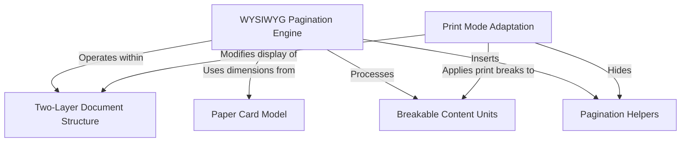
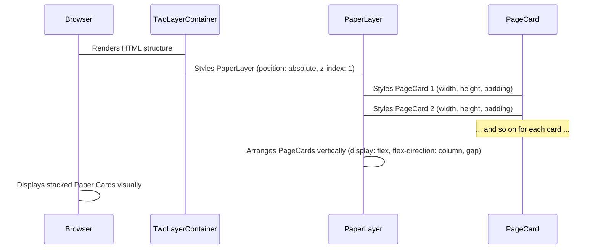
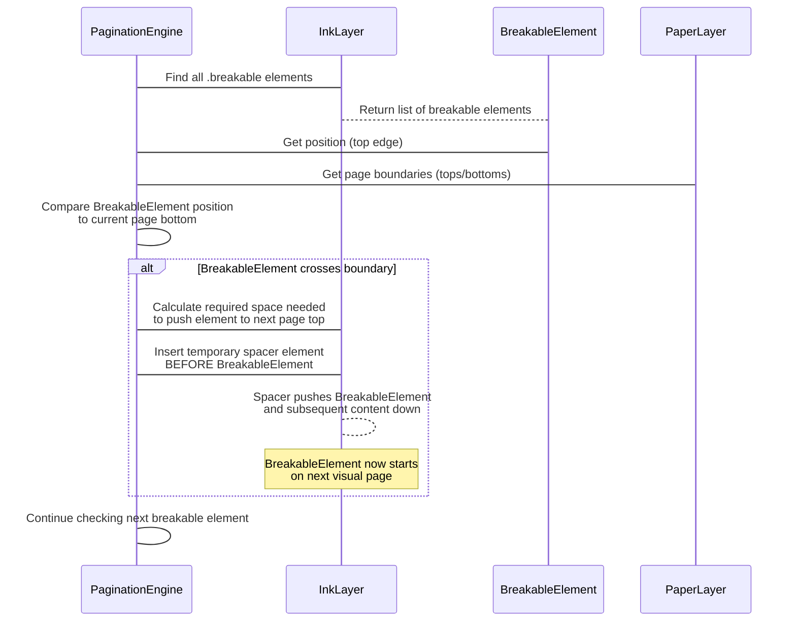
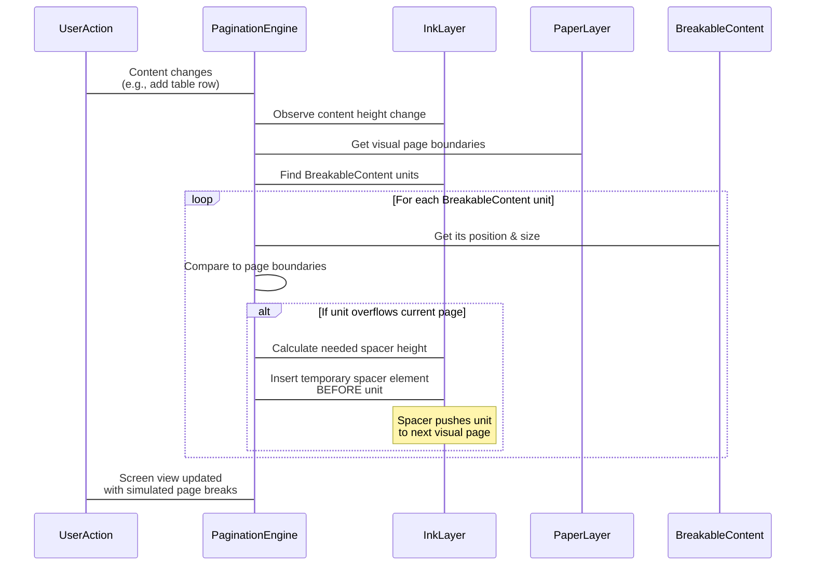
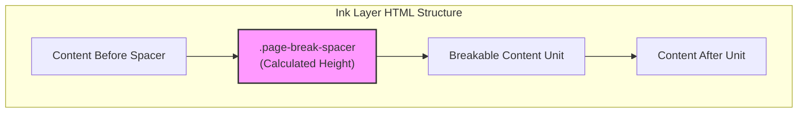
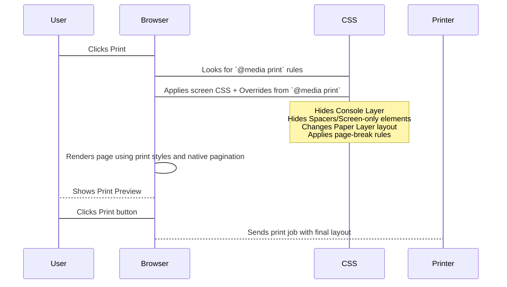

# Tutorial: Two-layer Paginator

This project simulates a printable court document directly in your web browser using a **Two-Layer Document Structure**. It includes a *WYSIWYG Pagination Engine* that automatically lays out content on screen based on virtual page outlines defined by the *Paper Card Model*. The engine identifies *Breakable Content Units* and inserts *Pagination Helpers* to simulate page breaks. Finally, *Print Mode Adaptation* ensures a clean, correct layout when the document is printed or saved as a PDF.


## Visual Overview




## Chapters

1. Two-Layer Document Structure
2. Paper Card Model
3. Breakable Content Units
4. WYSIWYG Pagination Engine
5. Pagination Helpers
6. Print Mode Adaptation

# Chapter 1: Two-Layer Document Structure

Welcome to the tutorial for the `coi-calculator` project! This project is designed to help users quickly and accurately calculate interest for court documents and produce print-ready outputs.

Web applications usually just scroll like one long page. But court documents are often printed on standard-sized paper. To make our application feel like you're working with a real document and make it easy to print correctly, we use a special setup called the **Two-Layer Document Structure**.

Think about it this way: when you're writing a court document, you're working with distinct pages. Our app tries to show you these pages right on your screen, just like they'll look when printed. This structure is the very first concept we need to understand because it forms the visual foundation of the entire application.

## The Idea: Layers Like Paper and Ink

Imagine you have a stack of blank paper pages. Then, imagine you have a transparent sheet where you write all your text, tables, and calculations (this is the "ink"). Finally, imagine another transparent sheet on top of everything with buttons, menus, and other interactive controls.

Our Two-Layer Document Structure uses this idea to organize what you see on the screen. We use three main layers, stacked on top of each other:

1.  **The Paper Layer:** This is the bottom layer. Its job is to show you the visual representation of the individual pages, like blank sheets of paper.
2.  **The Ink Layer:** This is the middle layer. It holds all the actual content of your document – the text, the tables, the numbers. It's like the "ink" on our transparent sheet, sitting visually on top of the paper pages.
3.  **The Console Layer:** This is the top layer. It contains all the interactive controls, like buttons and menus, that you use to interact with the calculator. It sits above everything else so you can always click on the controls.

This setup makes the screen look like distinct pages, which is perfect for an application designed to generate printable documents.

## Visualizing the Layers

Using CSS (the code that styles web pages), we can make these layers stack up using something called `z-index`. A higher `z-index` means an element sits on top of elements with a lower `z-index`.

Here's a simple visual idea of how these layers are stacked:

```mermaid
graph TD
    Console["Console Layer<br/>(z-index: 3)<br/>(Buttons, Menus)"]
    Ink["Ink Layer<br/>(z-index: 2)<br/>(Content: Text, Tables)"]
    Paper["Paper Layer<br/>(z-index: 1)<br/>(Page Visuals)"]

    Console --> Ink
    Ink --> Paper

    subgraph Screen View (Stacked)
        Console
        Ink
        Paper
    end

    style Console fill:#acf,stroke:#333,stroke-width:2px
    style Ink fill:#9cf,stroke:#333,stroke-width:2px
    style Paper fill:#ccf,stroke:#333,stroke-width:2px
```

In this diagram:
*   The **Paper Layer** is at the bottom (`z-index: 1`). It provides the visual background of pages.
*   The **Ink Layer** is in the middle (`z-index: 2`). This is where the document content sits.
*   The **Console Layer** is at the top (`z-index: 3`). This is where interactive elements like buttons live.

This stacking is crucial for making the app look and behave like a document generator. The content appears *on* the paper, and the controls appear *above* the content and paper.

## How the Code Creates These Layers

Let's look at the basic structure in the `index.html` file and how CSS styles create this layering effect.

First, the HTML file (`BC COIA calculator/index.html`) has a main container, and inside it, the three `div` elements for our layers:

```html
<!-- index.html -->
<div class="two-layer-container">
    <!-- Paper Layer (Bottom) -->
    <div class="paper-layer">
        <!-- Individual page visuals go here -->
    </div>

    <!-- Ink Layer (Middle) - Original content -->
    <div class="ink-layer">
        <!-- All your document content goes here -->
    </div>

    <!-- Console Layer (Top) - For UI elements above content -->
    <div class="console-layer">
        <!-- Interactive buttons and menus go here -->
    </div>
</div>
```

This HTML structure simply creates the three main boxes (divs). The magic of stacking comes from CSS. Let's look at small parts of the CSS files (`BC COIA calculator/styles/two-layer.css` and `BC COIA calculator/styles/console-layer.css`).

For the main container and the Paper Layer:

```css
/* two-layer.css */
.two-layer-container {
    position: relative; /* Needed so children can be absolute */
    /* ... other styling for centering and layout ... */
}

.paper-layer {
    position: absolute; /* Positioned relative to .two-layer-container */
    z-index: 1; /* This is the bottom layer visually */
    /* ... styling for layout and spacing between pages ... */
}

/* Styles for the visual page cards within the paper layer */
.page-card {
    /* Defines the size and look of a single page visual */
    width: var(--paper-width);
    height: var(--paper-height);
    background-color: var(--paper-background-color);
    box-shadow: 0 0 10px rgba(0, 0, 0, 0.1); /* Adds a shadow to look like stacked paper */
    position: relative; /* Needed for page number inside */
    /* ... other styling ... */
}
```

Here, `.two-layer-container` is set to `position: relative`. This is important because it allows its children (`.paper-layer`, `.ink-layer`, `.console-layer`) to be positioned absolutely (`position: absolute`) relative to *it*, not the whole page. The `.paper-layer` is `position: absolute` and `z-index: 1`, placing it at the bottom of our custom stack. The `.page-card` styles (from `BC COIA calculator/styles/page-cards.css` as well) define the actual look and size of the individual paper pages shown in this layer.

Next, the Ink Layer:

```css
/* two-layer.css */
.ink-layer {
    position: relative; /* Positioned relative to its normal flow position */
    z-index: 2; /* Sits above the paper layer */
    background-color: transparent; /* IMPORTANT: Allows the paper layer to show through! */
    width: var(--paper-width); /* Matches the paper width */
    padding: var(--paper-padding) var(--paper-padding) 0 var(--paper-padding); /* Adds padding like margins on a page */
    /* ... other styling ... */
}
```

The `.ink-layer` is set to `z-index: 2`, placing it visually above the `.paper-layer`. It's also set to `background-color: transparent` so you can see the paper visuals underneath. The width and padding are set using CSS variables (`--paper-width`, `--paper-padding`) which correspond to the size and margins of a physical page.

Finally, the Console Layer:

```css
/* console-layer.css */
.console-layer {
    position: absolute; /* Positioned relative to the .two-layer-container */
    top: 0;
    left: 0;
    width: 100%;
    height: 100%; /* Covers the full area of the container */
    z-index: 3; /* Sits above BOTH paper (1) and ink (2) layers */
    pointer-events: none; /* Default: allows clicks to pass through */
}

/* Individual console elements need pointer-events: auto to be interactive */
.console-layer > * {
    pointer-events: auto; /* Enables clicks on actual buttons/controls */
}
```

The `.console-layer` has the highest `z-index` (3), ensuring it's always on top. It's positioned absolutely to cover the whole container area. The `pointer-events` property is interesting:
*   `pointer-events: none` on the container means that normally, clicks just pass right through this layer to whatever is underneath (the ink or paper).
*   `pointer-events: auto` is set on the *children* of the console layer (like buttons or menus). This makes *those specific elements* clickable. This clever trick allows the interactive elements to be on top without blocking clicks on the document content when you don't click a button.

## What This Structure Achieves

By stacking these layers with CSS `z-index`, we create the visual effect of content (`ink-layer`) placed precisely on top of page shapes (`paper-layer`), with controls (`console-layer`) floating above everything.

This structure provides the foundation for:

1.  **Visual Simulation:** The user sees pages on their screen, making the interface intuitive for document creation.
2.  **Content Positioning:** The `ink-layer` provides a single area where content can be flowed and positioned, regardless of which "page" it visually appears on.
3.  **Interactive Controls:** Controls are kept separate on the top layer, ensuring they don't interfere with the document content layout and are always accessible.
4.  **Printing:** Using CSS `@media print` rules (which you saw briefly in the code snippets and will explore later), we can hide the console layer and adjust the other layers for optimal printing, making the content flow onto actual paper pages.

This Two-Layer structure is the basic canvas on which the rest of the application builds.

## Conclusion

In this chapter, we learned about the fundamental visual structure of the `coi-calculator` application: the **Two-Layer Document Structure**. We saw how three layers – Paper (bottom, pages), Ink (middle, content), and Console (top, controls) – are stacked using CSS `z-index` to simulate a physical document for better user experience and printing.

Understanding this basic layering is key to understanding how the app organizes and displays information.

In the next chapter, we'll dive deeper into the `paper-layer` and explore the [Paper Card Model](02_paper_card_model_.md), which explains how those individual page visuals are created and managed.

# Chapter 2: Paper Card Model

Welcome back! In the previous chapter, [Two-Layer Document Structure](01_two_layer_document_structure_.md), we learned how the `coi-calculator` app uses three stacked layers – Paper, Ink, and Console – to make the screen look like a document with distinct pages. We focused on how these layers are organized and stacked using CSS `z-index`.

Now, let's zoom in on the **Paper Layer**, the very bottom layer that provides the visual look of blank pages. This is where the **Paper Card Model** comes in.

## The Idea: Visual Pages on Screen

Imagine you're working with a stack of physical paper. Each sheet has a specific size (like 8.5 inches by 11 inches) and margins around the edge where you don't usually put text. Even before you write anything, you have these distinct, separate pages.

The **Paper Card Model** is how our app creates this visual experience online. Instead of one long scrolling background in the Paper Layer, we place individual visual representations of pages, like a stack of blank sheets laid out vertically.

These visual pages are represented by simple rectangular `div` elements in the HTML. We call them "Paper Cards" (`.page-card`) because they look and behave a bit like distinct cards stacked up.

The main job of a Paper Card is to show you *where* a page is and *what size* it is on the screen. They provide the visual boundaries for your content.

## What is a Paper Card?

At its heart, a Paper Card is just a `div` element with a specific CSS class (`.page-card`). You can see them in the `index.html` file inside the `.paper-layer`:

```html
<!-- BC COIA calculator/index.html (simplified) -->
<div class="two-layer-container">
    <!-- Paper Layer (Bottom) -->
    <div class="paper-layer">
        <!-- Individual page visuals go here -->
        <div class="page-card">
            <div class="page-number">Page 1</div>
        </div>
        <div class="page-card">
            <div class="page-number">Page 2</div>
        </div>
        <!-- ... more page-card elements as needed ... -->
    </div>

    <!-- Ink Layer (Middle) - Original content -->
    <div class="ink-layer">
        <!-- All your document content goes here -->
    </div>

    <!-- Console Layer (Top) - For UI elements above content -->
    <div class="console-layer">
        <!-- Interactive buttons and menus go here -->
    </div>
</div>
```

As you can see, the `.paper-layer` contains multiple `.page-card` elements. Each one visually represents a single page.

## Defining the Look: Size and Spacing

The appearance of these Paper Cards is controlled by CSS. The `paper-layer` itself is set up to arrange these cards like a vertical stack. The `.page-card` class defines the size and look of each individual "page."

Let's look at the relevant CSS:

```css
/* BC COIA calculator/styles/two-layer.css */
.paper-layer {
    position: absolute; /* Positioned within the container */
    z-index: 1; /* Bottom layer */
    display: flex; /* Use flexbox to arrange cards */
    flex-direction: column; /* Stack cards vertically */
    align-items: center; /* Center cards horizontally */
    gap: 30px; /* Adds space BETWEEN each page card */
    width: 100%; /* Takes full width of container */
    top: 0;
    left: 0;
}
```

This CSS for `.paper-layer` makes it an absolute-positioned container at the bottom (z-index 1). It uses `display: flex` and `flex-direction: column` to ensure that any `.page-card` elements placed inside it will stack neatly on top of each other vertically. The `gap: 30px` adds space, making it look like you have physical pages with gaps between them on a desk.

Now, let's see how each individual card is styled:

```css
/* BC COIA calculator/styles/page-cards.css */
.page-card {
  width: 8.5in; /* Standard letter paper width */
  height: 11in; /* Standard letter paper height */
  background-color: var(--paper-background-color, white); /* White background */
  box-shadow: 0 0 10px rgba(0, 0, 0, 0.1); /* Adds a subtle shadow */
  padding: 0.75in; /* Adds internal padding (margins) */
  box-sizing: border-box; /* Include padding in width/height */
  position: relative; /* Needed for page number inside */
  overflow: hidden; /* Prevents content from spilling outside */
}
```

This CSS for `.page-card` gives each card its dimensions (8.5 inches by 11 inches, or `--paper-width` and `--paper-height` via CSS variables elsewhere, which are set to these values). It gives it a white background and a shadow to make it look like a physical page. Crucially, it adds `padding: 0.75in`. This padding represents the margins of the page.

**Why are the dimensions and padding important?**

The dimensions (`width`, `height`) and the padding (`padding`) of the `.page-card` define the *exact usable area* for content on a single simulated page. The [Pagination Engine](04_wysiwyg_pagination_engine_.md) (which we'll cover later) uses these specific CSS values to calculate how much content from the Ink Layer can fit before it needs to "break" to the next page.

The space defined by the `gap` in `.paper-layer` and the `height` of `.page-card` determines the overall vertical rhythm of the document on the screen.

## How it Works: Showing Multiple Pages

The process is straightforward:

1.  The `two-layer-container` is set up as a positioning context.
2.  The `paper-layer` is placed inside, positioned absolutely, and styled to stack its children (`.page-card`) vertically with gaps.
3.  Multiple `.page-card` elements are added to the `paper-layer` (usually done dynamically by the application's JavaScript).
4.  Each `.page-card` is styled with the defined width, height, background, shadow, and padding, making it look like a distinct sheet of paper with margins.



This simple process creates the visual foundation of the application – a series of blank pages on which the content will eventually appear.

## Conclusion

In this chapter, we explored the **Paper Card Model**. We learned that Paper Cards (`.page-card`) are the visual rectangles in the Paper Layer that represent individual pages. Their dimensions (width, height, padding) and the gap between them (set on the `.paper-layer`) are crucial for creating the look of distinct pages and provide the visual grid used by the pagination system.

Understanding the Paper Card Model is essential because these visual cards determine the space available for your document content.

In the next chapter, we'll shift our focus to the Ink Layer and learn about [Breakable Content Units](03_breakable_content_units_.md) – how the actual content is structured to fit within the confines of these Paper Cards.

# Chapter 3: Breakable Content Units

Welcome back to the tutorial! In the previous chapter, [Paper Card Model](02_paper_card_model_.md), we learned how the `coi-calculator` application creates the visual representation of distinct pages using "Paper Cards" in the Paper Layer. These cards give our content a fixed space to fit into, just like a real page.

Now, let's think about the content itself, which lives in the Ink Layer. As you add more information – entries to a table, text descriptions, etc. – the content might grow and eventually need to flow from one visual page to the next. The process of figuring out where to end one page and start the next is called **pagination**.

## The Problem: Awkward Page Breaks

Imagine you have a section title, like "Prejudgment Interest Calculations". You definitely want this title to appear *immediately before* the calculations it describes. But what if the calculations from the previous section finish right at the very bottom of a page, and if you just added the "Prejudgment Interest Calculations" title, it would end up being the *only* thing on the top of the *next* page, with the actual table starting halfway down?

Or, what if a table row contains a lot of text or takes up significant vertical space? You wouldn't want that single table row to be split, with the top half on one page and the bottom half on the next. That looks messy and makes the document hard to read.

These are examples of **awkward page breaks**. When content automatically flows, the break point might fall in a visually undesirable spot.

## The Solution: Breakable Content Units

To avoid these awkward breaks, we need a way to tell the pagination system, "Hey, if you're going to break the page near this element, please put the break *before* it, not in the middle or just after a tiny bit of it."

This is where **Breakable Content Units** come in. These are specific HTML elements in your document content that are designated as points where a page break is *allowed and preferred to occur immediately before* if needed. If the pagination system detects that a Breakable Content Unit would span across a page boundary, it's instructed to simulate a page break *just before* that unit, ensuring the unit starts cleanly at the top of the next visual page.

Think of it like telling the system: "These specific elements are important logical blocks. Keep them together by putting the break right before them if they don't fit entirely on the current page."

## How to Mark Content as Breakable

The way we mark an element as a Breakable Content Unit in the `coi-calculator` is by adding a special CSS class to it: `.breakable`.

Let's look at some examples from the `index.html` file (simplified):

```html
<!-- index.html -->
<div class="ink-layer">
    <!-- ... other content ... -->

    <div>
        <!-- This section title is marked as breakable -->
        <div class="section-title breakable">Prejudgment Interest Calculations</div>
        <table class="interest-table" id="prejudgmentTable">
            <thead>
                <tr><th>Date</th><th>Description</th><th>Principal</th><th>Rate</th><th>Interest</th></tr>
            </thead>
            <!-- Table body content will be populated by JS -->
            <tbody data-display="prejudgmentTableBody">
                 <!-- Individual table rows might also be treated as breakable units -->
                 <!-- Although not explicitly marked `.breakable` in the HTML template, -->
                 <!-- they are handled similarly by the pagination logic -->
                 <tr> ... first row content ... </tr>
                 <tr> ... second row content ... </tr>
                 <!-- etc. -->
            </tbody>
            <tfoot> ... </tfoot>
        </table>
    </div>

    <div>
        <!-- This section title is also marked as breakable -->
        <div class="section-title breakable" id="postjudgmentTitle">Postjudgment Interest Calculations</div>
        <table class="interest-table" id="postjudgmentTable">
            <thead> ... </thead>
            <tbody data-display="postjudgmentTableBody">
                <!-- Table rows here too -->
            </tbody>
            <tfoot> ... </tfoot>
        </table>
    </div>

    <!-- ... other content ... -->
</div>
```

In this snippet, you can see that the `div` elements containing the classes `section-title` for "Prejudgment Interest Calculations" and "Postjudgment Interest Calculations" also have the `.breakable` class. This tells the system that these titles should ideally appear at the top of a page, not hanging alone at the bottom of the previous one.

While individual table rows (`<tr>`) aren't marked `.breakable` directly in the static HTML template, the JavaScript pagination logic is specifically written to treat *each table row* within the interest tables as a potential breakable unit as well. This is because splitting a table row is a common source of awkward breaks.

So, the `.breakable` class is a *flag* you add to an element to signal to the [Pagination Engine](04_wysiwyg_pagination_engine_.md) that it should try hard *not* to break the page *after* this element if doing so would leave the element orphaned or split across a page boundary. Instead, if the element's natural position would cause it to cross a page boundary, the system will insert a break *before* it.

## How it Works Under the Hood

The core of the pagination system (which we'll cover fully in the next chapter, [WYSIWYG Pagination Engine](04_wysiwy_pagination_engine_.md)) constantly monitors the content in the Ink Layer. Here's a simplified idea of what happens when it encounters a Breakable Content Unit:

1.  **Locate Breakable Units:** The system finds all elements that have the `.breakable` class (or, in the case of tables, specifically targets table rows).
2.  **Check Position:** For each breakable element, it calculates its position on the screen.
3.  **Compare to Page Boundaries:** It compares the element's position to the calculated boundaries of the visual pages (based on the size and spacing of the [Paper Card Model](02_paper_card_model_.md)).
4.  **Detect Overflow:** If the system determines that the *entire block* starting from the breakable element would spill over the current page boundary, it flags this spot for a break.
5.  **Insert Simulated Break:** To fix this on screen, the system inserts a temporary, invisible (or semi-invisible for debugging) element, typically a `div` or a `tr` with a specific height and class (`.page-break-spacer`), *just before* the breakable element.

This `.page-break-spacer` pushes the breakable element and everything that comes after it downwards. Because the `paper-layer` has gaps between pages, pushing content down by a specific height effectively makes the breakable element *appear* to start at the top of the *next* visual page on the screen.

Here's a simplified sequence:



The temporary spacer elements are added and removed dynamically by the pagination JavaScript (`pageBreaksCore.js` and `utils.js`). When the content changes (e.g., you add more items to a table), the pagination is recalculated, old spacers are removed (`clearPaginationHelpers` function), and new ones are inserted where needed.

Let's look at a snippet from `pageBreaksCore.js` where breakable elements are processed:

```javascript
// BC COIA calculator/dom/pageBreaks/pageBreaksCore.js
// ... inside updatePagination function ...

// Process Elements using .breakable class
const breakableElements = Array.from(inkLayer.querySelectorAll('.breakable'))
    .filter(element => element.offsetParent !== null && getElementOuterHeight(element) > 0);

for (let i = 0; i < breakableElements.length; i++) {
    const currentElement = breakableElements[i];
    const nextElement = breakableElements[i + 1]; // Next visible breakable element

    const currentElementTop = getElementAbsoluteTop(currentElement);

    // Calculate block height... (logic determines height of content block starting at currentElement)
    let blockHeight;
    // ... detailed height calculation logic ...

    // Determine current page index... (logic figures out which page the element starts on)
    let currentPageIndex = -1;
    // ... page index calculation logic ...

    // Check if the element block overflows the current page
    if (elementBottom > currentPageBottom) {
        // Ensure there's a next page boundary...
        if (currentPageIndex + 1 < workspaceTop.length) {
            const nextPageTop = workspaceTop[currentPageIndex + 1];
            const requiredSpacerHeight = nextPageTop - currentElementTop; // Calculate needed space

            if (requiredSpacerHeight > 0) {
                // Insert the page break helper!
                insertPageBreakBeforeElement(currentElement, requiredSpacerHeight);
            }
        }
    }
}
// ... rest of updatePagination function ...
```

This loop iterates through the elements marked `.breakable`. It calculates if the element and the content immediately following it would cross the bottom boundary of the current page (`currentPageBottom`). If it does, it calculates the `requiredSpacerHeight` needed to push the `currentElement`'s top (`currentElementTop`) down to the top of the *next* page's workspace (`nextPageTop`). Then, it calls `insertPageBreakBeforeElement`.

The `insertPageBreakBeforeElement` function (found in `utils.js`) is responsible for creating and inserting the visual spacer:

```javascript
// BC COIA calculator/dom/pageBreaks/utils.js
// ...

/**
 * Inserts a page break (spacer and potentially repeated header) before a given element.
 * @param {HTMLElement} element - The .breakable element requiring a page break before it.
 * @param {number} requiredSpacerHeight - The calculated height needed for the spacer.
 */
export function insertPageBreakBeforeElement(element, requiredSpacerHeight) {
    if (!element || requiredSpacerHeight <= 0) return;

    if (element.tagName === 'TR') {
        // Handle table rows: insert blank row spacer and repeat header
        // ... calls insertBlankRow ...
        // ... calls insertHeaderRow ...
    } else {
        // Handle other elements: insert a generic div spacer
        insertBlankSpace(element, requiredSpacerHeight);
    }
}

/**
 * Creates and inserts blank space (div) before an element.
 * @param {HTMLElement} referenceElement - The element to insert space before.
 * @param {number} height - The height of the blank space.
 */
export function insertBlankSpace(referenceElement, height) {
    if (!referenceElement || height <= 0) return;
    const blankSpace = document.createElement('div');
    blankSpace.classList.add('page-break-spacer'); // Add the class for cleanup
    blankSpace.style.height = `${height}px`; // Set the calculated height
    // ... other styling for debugging/print ...

    referenceElement.parentNode.insertBefore(blankSpace, referenceElement);
    return blankSpace;
}

// ... insertBlankRow and other utility functions ...

/**
 * Removes temporary elements created by the pagination logic (spacers and repeated headers).
 */
export function clearPaginationHelpers() {
    document.querySelectorAll('.page-break-spacer, .repeated-header').forEach(el => el.remove());
}
```

This code shows that `insertPageBreakBeforeElement` checks if the breakable element is a table row (`<tr>`) or something else.
*   If it's a table row, it calls `insertBlankRow` (which creates a `<tr>` spacer) and potentially `insertHeaderRow` to repeat the table header on the new page.
*   If it's not a table row (like a section title `div`), it calls `insertBlankSpace` (which creates a `div` spacer).

In both cases, a temporary element with the class `.page-break-spacer` is created, given the necessary height (`requiredSpacerHeight`), and inserted into the Ink Layer *before* the `referenceElement`. This visual spacer pushes the content down so that the `referenceElement` appears to start cleanly at the top of the next page. The `clearPaginationHelpers` function ensures these temporary spacers are removed before a new pagination calculation runs.

This system ensures that important content blocks, like section titles and table rows, stay visually together and don't get awkwardly split across pages on the screen display.

## Conclusion

In this chapter, we learned about **Breakable Content Units**. We saw that these are specific HTML elements (like section titles or table rows) marked with the `.breakable` class or targeted specifically by the pagination logic. This marking tells the system where it is visually acceptable and preferred to insert a simulated page break *before* the element if it would otherwise cross a page boundary. We also got a glimpse into how the system works by detecting these elements and inserting temporary spacer elements to force them onto the next visual page on the screen.

Understanding Breakable Content Units is key to seeing how the application makes the on-screen document flow naturally across the [Paper Card Model](02_paper_card_model_.md) pages.

In the next chapter, we'll put it all together and explore the **[WYSIWYG Pagination Engine](04_wysiwyg_pagination_engine_.md)**, the core system that performs these measurements and manipulations to make the document look correct on screen.

# Chapter 4: WYSIWYG Pagination Engine

Welcome back to the tutorial! So far, we've learned about the visual foundation of our application:
*   Chapter 1: [Two-Layer Document Structure](01_two_layer_document_structure_.md) showed us how the screen is layered with the Paper (pages), Ink (content), and Console (controls) layers.
*   Chapter 2: [Paper Card Model](02_paper_card_model_.md) explained how the Paper Layer creates the look of individual pages on screen using `.page-card` elements with specific sizes and spacing.
*   Chapter 3: [Breakable Content Units](03_breakable_content_units_.md) introduced the idea of marking content elements (`.breakable` class) that shouldn't be awkwardly split across pages.

Now, we bring these concepts together with the "brain" that makes it all work on screen: the **WYSIWYG Pagination Engine**.

## The Problem: Making Screen Look Like Print

Web pages normally just scroll endlessly. But our goal is to create a document that looks correct when printed on standard paper. This means the content needs to flow across distinct pages. How do we make the view on the computer screen accurately show where those page breaks will occur, *before* you even print?

We want a **WYSIWYG** (What You See Is What You Get) experience. If a table row or a section title would start a new page when printed, we want it to start on a new visual "page" on the screen as well.

## The Solution: The WYSIWYG Pagination Engine

This is the job of the **WYSIWYG Pagination Engine**. It's a JavaScript system that constantly watches the content in the Ink Layer and compares its position and height to the boundaries of the visual pages defined by the [Paper Card Model](02_paper_card_model_.md).

If it detects that a piece of content (especially a [Breakable Content Unit](03_breakable_content_units_.md)) is about to cross a page boundary, the engine cleverly injects temporary elements into the Ink Layer. These temporary elements act like spacers or pushers, forcing the overflowing content onto the next visual page on the screen.

This gives you a real-time preview of how your document will be paginated, making the screen view closely match the eventual print output.

## How the Engine Works (High Level)

Think of the engine as an intelligent layout manager working within the Ink Layer, guided by the Paper Layer.

Here's a simplified idea of its process:

1.  **Measure the Pages:** It first calculates the exact vertical position (top and bottom) of the usable content area for *each* visual page card in the Paper Layer. This gives it the page boundaries.
2.  **Watch the Content:** It monitors the content within the Ink Layer. This is often triggered when content changes (e.g., you add an item to a table) or when the window is resized.
3.  **Find Break Points:** It iterates through the content, paying special attention to the [Breakable Content Units](03_breakable_content_units_.md) (elements with the `.breakable` class or table rows).
4.  **Check for Overflow:** For each breakable unit, it calculates if the unit itself, or the block of content starting at that unit, would extend beyond the bottom boundary of the current visual page.
5.  **Insert Spacers:** If overflow is detected, the engine calculates exactly how much vertical space is needed to push the breakable unit's top edge down to the top edge of the *next* visual page's usable area. It then dynamically creates a temporary, invisible spacer element (like a `div` or `<tr>`) with that calculated height and inserts it *before* the breakable unit in the Ink Layer's HTML.
6.  **Repeat Headers (for Tables):** If the breakable unit is a table row that is pushed to a new page, the engine might also insert a temporary, cloned header row from that table at the top of the new visual page section.
7.  **Clean Up:** Before recalculating, it removes any previously inserted temporary spacers and repeated headers to start fresh.

This happens fast enough that as you type or add data, the pages seem to adjust automatically before your eyes.

Here's a simple diagram illustrating the core idea:



## How the Code Implements This

The main logic for the pagination engine lives in the `BC COIA calculator/dom/pageBreaks/pageBreaksCore.js` file, supported by utility functions in `BC COIA calculator/dom/pageBreaks/utils.js`.

Let's look at simplified parts of the code that demonstrate the key steps:

First, the main `updatePagination` function in `pageBreaksCore.js` gets called whenever the content might have changed:

```javascript
// BC COIA calculator/dom/pageBreaks/pageBreaksCore.js (Simplified)
export function updatePagination() {
    // ... (Protection against recursive calls) ...

    try {
        clearPaginationHelpers(); // Remove old spacers and headers

        const inkLayer = document.querySelector('.ink-layer');
        const paperLayer = document.querySelector('.paper-layer');

        if (!inkLayer || !paperLayer) return; // Exit if layers missing

        // --- Step 1: Measure the Pages ---
        // (Code calculates pageCardHeight, pageGap, workspaceTop, workspaceBottom)
        // This uses the dimensions from the Paper Card Model!
        const workspaceTop = []; // Array of top boundaries for each page's content area
        const workspaceBottom = []; // Array of bottom boundaries for each page's content area
        // ... (measurement code populates workspaceTop and workspaceBottom) ...


        // --- Step 3 & 4: Find Break Points & Check for Overflow ---
        // Find all elements marked with .breakable (excluding hidden ones)
        const breakableElements = Array.from(inkLayer.querySelectorAll('.breakable'))
            .filter(element => element.offsetParent !== null && getElementOuterHeight(element) > 0);

        // Also add table rows as breakable units
        const tableRows = Array.from(inkLayer.querySelectorAll('#prejudgmentTableBody > tr, #postjudgmentTableBody > tr'))
             .filter(element => element.offsetParent !== null && getElementOuterHeight(element) > 0);
        const allBreakableUnits = [...breakableElements, ...tableRows];

        // Sort elements by their position to process them in order
        allBreakableUnits.sort((a, b) => getElementAbsoluteTop(a) - getElementAbsoluteTop(b));


        for (let i = 0; i < allBreakableUnits.length; i++) {
            const currentElement = allBreakableUnits[i];
            const currentElementTop = getElementAbsoluteTop(currentElement);

            // Determine which page the element currently starts on
            let currentPageIndex = -1;
             for (let pageIdx = 0; pageIdx < workspaceTop.length; pageIdx++) {
                if (currentElementTop >= workspaceTop[pageIdx] &&
                    (pageIdx + 1 >= workspaceTop.length || currentElementTop < workspaceTop[pageIdx + 1])) {
                    currentPageIndex = pageIdx;
                    break;
                }
            }

            // If element is on a valid page and not the last page...
            if (currentPageIndex !== -1 && currentPageIndex < workspaceBottom.length -1 ) {

                const currentPageBottom = workspaceBottom[currentPageIndex];

                // Calculate the height of the *content block* starting here
                // This is the trickiest part: it needs to measure from the
                // currentElementTop down to the NEXT breakable unit,
                // or to the end of the document if it's the last unit.
                let blockHeight;
                const nextElement = allBreakableUnits[i + 1]; // Next breakable unit
                 if (nextElement) {
                    const nextElementTop = getElementAbsoluteTop(nextElement);
                     // Height is distance to next breakable unit
                    blockHeight = nextElementTop - currentElementTop;
                } else {
                    // If it's the last unit, measure its own height (simplified)
                    // (The actual code is more complex to include non-breakable content after it)
                    blockHeight = getElementOuterHeight(currentElement);
                }

                const elementBottom = currentElementTop + blockHeight;

                // Check if the calculated block overflows the current page bottom
                if (elementBottom > currentPageBottom) {
                    // --- Step 5 & 6: Insert Spacers/Helpers ---
                    const nextPageTop = workspaceTop[currentPageIndex + 1];
                    const requiredSpacerHeight = nextPageTop - currentElementTop;

                    if (requiredSpacerHeight > 0) {
                        // This function inserts the div/tr spacer and maybe a header
                        insertPageBreakBeforeElement(currentElement, requiredSpacerHeight);
                    }
                }
            }
        }

        // --- Final Check: Ensure last page is correct ---
        // (Code adds or removes the last page card based on total content height)
        // ...

    } finally {
        // ... (Reset isUpdatingPagination flag) ...
    }
}
```

This function first calculates the page boundaries (`workspaceTop`, `workspaceBottom`) based on the dimensions from the [Paper Card Model](02_paper_card_model_.md). Then, it loops through the elements identified as Breakable Content Units. For each unit, it figures out which page it's on and calculates if the content block starting at that unit goes past the bottom edge of the current page's content area. If it does, it calculates the needed space and calls `insertPageBreakBeforeElement`.

Now, let's look at simplified versions of the utility functions in `utils.js` that actually insert the temporary elements:

```javascript
// BC COIA calculator/dom/pageBreaks/utils.js (Simplified)

/**
 * Inserts a page break (spacer and potentially repeated header) before an element.
 * Calls insertBlankSpace for divs or insertBlankRow/insertHeaderRow for trs.
 */
export function insertPageBreakBeforeElement(element, requiredSpacerHeight) {
    if (!element || requiredSpacerHeight <= 0) return;

    if (element.tagName === 'TR') {
        // Handle table rows: insert blank row spacer and repeat header
        // ... calls insertBlankRow(element, requiredSpacerHeight) ...
        // ... calls insertHeaderRow(...) if needed ...
    } else {
        // Handle other elements (like .breakable divs): insert a generic div spacer
        insertBlankSpace(element, requiredSpacerHeight);
    }
}

/**
 * Creates and inserts blank space (div) before an element.
 * This is used for non-table breakable elements.
 */
export function insertBlankSpace(referenceElement, height) {
    if (!referenceElement || height <= 0) return;

    const blankSpace = document.createElement('div');
    blankSpace.classList.add('page-break-spacer'); // Important for cleanup
    blankSpace.style.height = `${height}px`; // Set the calculated height

    // Insert the spacer into the Ink Layer before the reference element
    referenceElement.parentNode.insertBefore(blankSpace, referenceElement);
    return blankSpace;
}

/**
 * Creates and inserts a blank row (tr) for spacing within a table.
 * This is used for table row breaks.
 */
export function insertBlankRow(referenceRow, height) {
    if (!referenceRow || height <= 0) return;

    const blankRow = document.createElement('tr');
    blankRow.classList.add('page-break-spacer'); // Important for cleanup

    const cell = document.createElement('td');
    // Need to set colspan so the single cell spans the whole row
    // (Code figures out the correct colspan)
    cell.setAttribute('colspan', '...'); // colspan based on table
    cell.style.height = `${height}px`;
    cell.style.padding = '0';
    cell.style.border = 'none';

    blankRow.appendChild(cell);

    // Insert the spacer row into the Ink Layer before the reference row
    referenceRow.parentNode.insertBefore(blankRow, referenceRow);

    // Add CSS styles to the *next* row to force a print break later
    referenceRow.style.pageBreakBefore = 'always';
    referenceRow.style.breakBefore = 'page';

    return blankRow;
}

/**
 * Removes temporary elements created by the pagination logic.
 * Called at the start of updatePagination.
 */
export function clearPaginationHelpers() {
    // Find all elements with these classes and remove them
    document.querySelectorAll('.page-break-spacer, .repeated-header').forEach(el => el.remove());
}
```

These utility functions show that when a break is needed, the engine creates either a `div` or a `<tr>` element, adds a `.page-break-spacer` class to it (so it can be found and removed later), sets its height to the precisely calculated amount (`requiredSpacerHeight`), and inserts it into the Ink Layer's structure just before the element that needed pushing. For table rows, it also marks the row *after* the spacer with print-specific CSS (`page-break-before`) which helps ensure the *actual* print output also breaks there.

## Connecting the Pieces

You can see how the concepts from previous chapters are used here:
*   The **Two-Layer Structure** provides the `ink-layer` and `paper-layer` that the engine operates on.
*   The **Paper Card Model** defines the dimensions and spacing of the visual pages, giving the engine the `workspaceTop` and `workspaceBottom` boundaries to check against.
*   **Breakable Content Units** (`.breakable` class, table rows) tell the engine *where* it's appropriate and preferred to insert a spacer if necessary.

The WYSIWYG Pagination Engine is the active process that uses these inputs to dynamically adjust the layout on screen, creating the simulated page breaks you see.

## Conclusion

In this chapter, we explored the **WYSIWYG Pagination Engine**. We learned that it's the core JavaScript system responsible for simulating page breaks on screen to provide a "What You See Is What You Get" view. It does this by measuring content height, comparing it to visual page boundaries (from the [Paper Card Model](02_paper_card_model_.md)), identifying potential awkward breaks (using [Breakable Content Units](03_breakable_content_units_.md)), and inserting temporary spacer elements (`.page-break-spacer`) to push content onto the next visual page on screen.

This dynamic adjustment gives the user a realistic preview of the document's layout.

In the next chapter, we will take a closer look at these **[Pagination Helpers](05_pagination_helpers_.md)** – the temporary elements inserted by the engine, and why they are needed both for the on-screen view and for actual printing.

# Chapter 5: Pagination Helpers

Welcome back! In the previous chapter, [WYSIWYG Pagination Engine](04_wysiwy_pagination_engine_.md), we learned that the core of our application's layout is a smart JavaScript system (the Engine) that watches your content and figures out where page breaks *should* happen on screen to match how the document will look when printed. It does this by comparing the content's position to the visual pages from the [Paper Card Model](02_paper_card_model_.md) and looking for [Breakable Content Units](03_breakable_content_units_.md).

But how does the Engine actually *make* content jump to the next page on your screen? How does it visually show you that a break has occurred? It can't just magically move HTML elements around based on page concepts alone, because the Ink Layer is essentially one long scrollable area.

## The Problem: Simulating Physical Space on Screen

Imagine you have a section title that the Engine determines needs to start on a new page. In a real-world document, it would just start at the top of the next physical sheet of paper. But on our screen, the Ink Layer is continuous. If the title is currently sitting near the bottom of where the first visual page ends, how do we push it all the way down to where the second visual page *starts*?

We need something *in the HTML structure itself* that takes up space and pushes subsequent content down, simulating the jump from the bottom of one page to the top of the next.

## The Solution: Pagination Helpers

This is where **Pagination Helpers** come in. These are special HTML elements that the [WYSIWYG Pagination Engine](04_wysiwy_pagination_engine_.md) dynamically creates and inserts into the `ink-layer`. They don't hold any actual document content. Their *only* job is to take up a precise amount of vertical space on the screen.

By inserting a Pagination Helper with exactly the right height just before a [Breakable Content Unit](03_breakable_content_units_.md) that needs to move to the next page, the Engine effectively pushes that unit and everything after it down. Since the [Paper Card Model](02_paper_card_model_.md) creates visible gaps between the visual pages in the `paper-layer`, pushing content down by the combined height of the current page's remaining space + the gap + the next page's top margin makes the content *appear* to align perfectly with the top of the next visual page on the screen.

Crucially, these helpers are only for the *screen display*. When you go to print, they are hidden using CSS.

Let's look at the main types of Pagination Helpers:

1.  **`.page-break-spacer`**: These are the primary workhorses. They are typically simple `div` or `<tr>` elements inserted to create blank vertical space.
2.  **`.repeated-header`**: Used specifically when a table row breaks to a new page. The Engine might insert a *clone* of the table's header row just after the spacer, so the table headers appear repeated at the top of the new visual page section.

## How `.page-break-spacer` Works

Think of a `.page-break-spacer` as a temporary, invisible block you put into the Ink Layer.

Here's the idea:



The `height` of the `Spacer` element is calculated by the [WYSIWYG Pagination Engine](04_wysiwy_pagination_engine_.md) to be exactly the distance needed to push the `BreakableUnit` down to the top of the next visual page on screen.

For example, if the bottom of the current page is at 500px on screen, and the top of the next page is at 600px (due to the page gap), and your breakable element is currently starting at 480px, the Engine needs to push it down `600px - 480px = 120px`. So, it would insert a `.page-break-spacer` with `height: 120px;` just before that element. This pushes the element to start at `480px + 120px = 600px`, aligning it with the next page's top.

These spacers are styled with a CSS class, primarily `.page-break-spacer`, and often combined with a `.screen-only` class to ensure they are *only* visible on the screen, not in print.

From `pageBreaksCore.js` (which you saw in the last chapter), the `insertPageBreakBeforeElement` function calls `insertBlankSpace` for non-table elements:

```javascript
// BC COIA calculator/dom/pageBreaks/utils.js (Simplified)
export function insertBlankSpace(referenceElement, height) {
    if (!referenceElement || height <= 0) return;

    const blankSpace = document.createElement('div');
    // Add spacer class for identification and screen-only for hiding in print
    blankSpace.classList.add('page-break-spacer', 'screen-only'); 
    blankSpace.style.height = `${height}px`; // Set calculated height

    // Insert the spacer into the DOM just before the referenceElement
    referenceElement.parentNode.insertBefore(blankSpace, referenceElement);

    // ... print-specific CSS rule added to referenceElement ...
}
```

And for table rows, it uses `insertBlankRow`:

```javascript
// BC COIA calculator/dom/pageBreaks/utils.js (Simplified)
export function insertBlankRow(referenceRow, height) {
    if (!referenceRow || height <= 0) return;

    const blankRow = document.createElement('tr');
    // Add spacer class and screen-only class
    blankRow.classList.add('page-break-spacer', 'screen-only'); 

    // Create a cell that spans all columns and has the calculated height
    const cell = document.createElement('td');
    // ... code to calculate colspan ...
    cell.setAttribute('colspan', '...'); 
    cell.style.height = `${height}px`;
    // ... other styling to make it blend in ...

    blankRow.appendChild(cell);
    // Insert the spacer row into the table body before the referenceRow
    referenceRow.parentNode.insertBefore(blankRow, referenceRow);

    // ... print-specific CSS rules added to referenceRow ...
}
```

In both cases, a temporary element (`div` or `tr`) with a precise height is created and inserted. The `.page-break-spacer` class identifies it as a pagination helper, and the `.screen-only` class, combined with styles in `print.css`, ensures it's hidden when printing.

## How `.repeated-header` Works (For Tables)

When a table breaks across pages, it's helpful to see the table header repeated at the top of the new page section on screen. The Engine does this using `.repeated-header`.

If a table row is pushed to a new page, the Engine will insert a clone of the original table header row *after* the `.page-break-spacer` row, but *before* the table row that's starting the new page section.

```javascript
// BC COIA calculator/dom/pageBreaks/utils.js (Simplified)
export function insertHeaderRow(referenceRow, originalHeaderRow) {
    if (!referenceRow || !originalHeaderRow) return 0;

    const clonedHeader = originalHeaderRow.cloneNode(true); // Make a copy of the header
    // Add screen-only and repeated-header classes
    clonedHeader.classList.add('screen-only', 'repeated-header'); 

    // Optional styling to make it look slightly different (e.g., subtle background)
    // clonedHeader.style.backgroundColor = '...';

    // Insert the cloned header into the DOM just before the referenceRow
    referenceRow.parentNode.insertBefore(clonedHeader, referenceRow);

    return getElementOuterHeight(clonedHeader); // Return its height (less critical than spacer height)
}
```

This cloned header is also marked with `.screen-only` and `.repeated-header`, ensuring it's only visible on your monitor and not in the actual print output.

## Why They Are Temporary

The content in the `coi-calculator` is dynamic. You can add or remove table rows, change text, etc. Each time the content changes in a way that might affect pagination, the [WYSIWYG Pagination Engine](04_wysiwy_pagination_engine_.md) needs to recalculate where the breaks should be.

Before recalculating and inserting *new* helpers, it first removes all the *old* ones. This is done by finding all elements with the classes `.page-break-spacer` and `.repeated-header` and removing them from the DOM.

```javascript
// BC COIA calculator/dom/pageBreaks/utils.js
export function clearPaginationHelpers() {
    // Find all elements with these specific classes
    document.querySelectorAll('.page-break-spacer, .repeated-header').forEach(el => {
        // Remove the element from the DOM
        el.remove();
    });
}
```

This `clearPaginationHelpers` function is called at the very beginning of the `updatePagination` process in `pageBreaksCore.js`. This ensures that the layout is clean before the engine adds the necessary helpers for the *current* state of the content.

## Connecting the Pieces

Pagination Helpers are the concrete tools the [WYSIWYG Pagination Engine](04_wysiwy_pagination_engine_.md) uses.
*   The Engine calculates the needed space based on the visual page layout from the [Paper Card Model](02_paper_card_model_.md) and the positions of [Breakable Content Units](03_breakable_content_units_.md).
*   It then *creates* `.page-break-spacer` (and sometimes `.repeated-header`) elements with the correct dimensions.
*   These helpers are *inserted* into the [Ink Layer](01_two_layer_document_structure_.md)'s HTML structure, pushing subsequent content down to align with the next visual page on screen.
*   They are marked as `.screen-only` so they disappear during printing ([Print Mode Adaptation](06_print_mode_adaptation_.md)).
*   They are removed and re-inserted whenever the content changes.

They are the invisible "shims" or "spacers" that make the continuous Ink Layer *look* like it's flowing across distinct pages on your screen.

## Conclusion

In this chapter, we looked at **Pagination Helpers**. We learned that these are temporary HTML elements like `.page-break-spacer` (for general spacing) and `.repeated-header` (for table headers) that are dynamically inserted by the [WYSIWYG Pagination Engine](04_wysiwy_pagination_engine_.md) into the Ink Layer. Their purpose is solely to take up calculated vertical space on the screen to simulate page breaks and push content onto the next visual page. We saw how they are added before [Breakable Content Units](03_breakable_content_units_.md) and are hidden in print using CSS classes like `.screen-only`.

Understanding these helpers reveals how the visual page breaks you see on screen are actually achieved by manipulating the HTML structure with temporary, purpose-built elements.

In the next and final chapter, we'll explore **[Print Mode Adaptation](06_print_mode_adaptation_.md)**, and how the application ensures that the content, now correctly paginated on screen, prints correctly onto physical paper pages.

# Chapter 6: Print Mode Adaptation

Welcome to the final chapter of our tutorial! We've covered how the `coi-calculator` application structures content ([Two-Layer Document Structure](01_two_layer_document_structure_.md), [Paper Card Model](02_paper_card_model_.md)), identifies break points ([Breakable Content Units](03_breakable_content_units_.md)), and uses a clever engine with temporary helpers ([WYSIWYG Pagination Engine](04_wysiwy_pagination_engine_.md), [Pagination Helpers](05_pagination_helpers_.md)) to make the document look correctly paginated *on your screen*.

But the ultimate goal is often to get a clean, correctly formatted document printed on physical paper or saved as a PDF using the browser's print function. The beautiful on-screen simulation with stacked paper cards and floating console elements isn't what you want to see on a printed page.

## The Problem: Screen View vs. Print Output

Think about what you see on your screen:
*   Distinct visual "pages" with shadows and gaps, created by the [Paper Card Model](02_paper_card_model_.md).
*   Interactive buttons and menus floating above the content in the [Console Layer](01_two_layer_document_structure_.md).
*   Temporary `.page-break-spacer` elements inserted by the [WYSIWYG Pagination Engine](04_wysiwy_pagination_engine_.md) to push content down on screen.
*   Visual page numbers inside the on-screen page cards.

None of these things should appear on a final printed document. The printed output should just be the content, flowing naturally across standard-sized pages with correct margins, headings in the right places, and no on-screen clutter.

## The Solution: Print Mode Adaptation

This is where **Print Mode Adaptation** comes in. It's a set of special instructions using CSS that tells the browser, "Hey, when you're about to print this page, ignore some of the usual screen styles and use *these* specific styles instead."

These print-specific styles are contained within a special CSS rule called `@media print`. Any CSS rules placed inside `@media print { ... }` will *only* be applied when the browser's print dialog is open or when the page is being printed.

```css
/* This style applies all the time, on screen */
.some-element {
    background-color: blue;
    margin-bottom: 20px;
}

/* This style ONLY applies when printing */
@media print {
    .some-element {
        background-color: white; /* Change background for print */
        margin-bottom: 5px;     /* Adjust margin for print */
    }
}
```

When you're viewing the page on screen, `.some-element` will have a blue background and a 20px bottom margin. But when you hit Print, the browser sees the `@media print` rule and overrides those styles, making the background white and the margin 5px *just for the printout*.

The `coi-calculator` uses `@media print` extensively to transform the screen layout into a clean, print-ready document.

## Key Adaptations for Printing

Let's look at the main things the application does within `@media print` to prepare the document for printing:

1.  **Hiding Screen-Only Elements:** Any element that is purely for the screen interface or the screen-based simulation is hidden.
2.  **Adjusting Layout:** The special layout that creates the visual paper stack on screen is disabled.
3.  **Using Native Page Breaks:** Instead of relying on temporary spacer elements, the application uses standard CSS `page-break` properties to tell the browser exactly where it's allowed or preferred to split the content onto physical pages.

## How the Code Adapts for Print

Most of the print adaptation happens in the CSS files, particularly `BC COIA calculator/styles/print.css` and `@media print` blocks within other CSS files like `two-layer.css` and `console-layer.css`.

Let's look at simplified examples:

**1. Hiding the Console Layer:**
The Console Layer contains buttons, menus, and other interactive elements that have no place in a printed document.

```css
/* BC COIA calculator/styles/console-layer.css */
/* ... styles for screen view ... */

/* Print styles */
@media print {
    .console-layer {
        display: none !important; /* Hide the entire console layer when printing */
    }
}
```
The `display: none !important;` rule inside `@media print` makes the entire `.console-layer` invisible during printing. The `!important` keyword is often used in print stylesheets to ensure these critical print rules override any potentially conflicting screen styles.

**2. Hiding Pagination Helpers and Screen-Only Markers:**
The temporary `.page-break-spacer` elements and any other elements marked with `.screen-only` are only needed to make the on-screen view look correct.

```css
/* BC COIA calculator/styles/page-breaks.css */
/* ... styles for screen view ... */

/* Note: Print styles for .screen-only are handled in print.css */

/* BC COIA calculator/styles/print.css */
@media print {
    /* Hide spacers */
    .page-break-spacer {
        display: none !important;
    }

    /* Hide elements specifically for screen display */
    .screen-only {
        display: none !important;
    }
    
    /* Hide debug markers */
    .page-break-indicator { /* Used sometimes for debugging breaks */
         display: none !important;
    }

    /* ... other print styles ... */
}
```
By setting `display: none !important;` for `.page-break-spacer`, `.screen-only`, and `.page-break-indicator` within `@media print`, these elements disappear completely in the printed output. The actual content that comes *after* these spacers is what matters for printing.

**3. Adjusting the Layout and Paper Layer:**
The layered structure and visual paper cards are replaced by a simpler flow suitable for print.

```css
/* BC COIA calculator/styles/two-layer.css */
/* ... styles for screen view of two-layer-container and paper-layer ... */

/* Print styles */
@media print {
    .two-layer-container {
        display: block; /* Change from flex column to a simple block flow */
    }

    .paper-layer {
        position: static; /* Disable absolute positioning */
        display: block; /* Change from flex column to a simple block flow */
        gap: 0; /* Remove gaps between pages */
    }

    .paper-layer .page-card {
        box-shadow: none; /* Remove box shadow */
        margin: 0; /* Remove margins */
        height: auto; /* Allow height to be determined by content + padding */
        /* page-break-after: always; */ /* Sometimes applied here or handled by content below */
    }

    /* Hide page numbers when printing */
    .page-number {
        display: none; /* Hide page numbers */
    }
    /* ... other print styles ... */
}

/* BC COIA calculator/styles/print.css */
@media print {
    /* Ensure the ink layer takes up appropriate print space */
    .ink-layer {
        margin: 0 !important;
        padding: var(--paper-padding) var(--paper-padding) 0 var(--paper-padding) !important; /* Keep screen padding (margins) */
        width: var(--paper-width) !important; /* Keep screen width (content area) */
        min-height: auto !important; /* Remove fixed screen height */
        height: auto !important;
        box-shadow: none !important;
        border: none !important;
        box-sizing: border-box !important;
        page-break-after: auto !important;
        position: static !important;
        overflow: visible !important;
    }

    /* Define print page size and margins */
     @page {
        size: letter; /* Use standard letter size */
        margin-top: 0.75in; /* Add top margin to subsequent pages */
        margin-left: 0; /* Margins applied via ink-layer padding */
        margin-right: 0;
        margin-bottom: 0;
    }

    @page :first {
        size: letter;
        margin: 0; /* No top margin on the first page often desired */
    }

    /* ... other print styles ... */
}
```
In print mode, the `.two-layer-container` and `.paper-layer` become simple `display: block` elements with no gaps or shadows. The `.page-card` elements inside the paper layer lose their fixed screen height and shadow, serving mainly as containers for the content on that physical page. The `.ink-layer` also loses its absolute/relative positioning and fixed height, flowing naturally. The actual page dimensions and margins for the *physical* paper are set using the standard `@page` CSS rule.

**4. Using Standard Page Break Properties:**
Instead of relying on the JavaScript-inserted helpers for spacing, the print stylesheet uses native CSS properties to suggest or force page breaks.

```css
/* BC COIA calculator/styles/print.css */
@media print {
    /* Prevent breaking inside table rows */
    tr {
        page-break-inside: avoid !important;
        break-inside: avoid !important; /* Modern syntax */
    }

    /* Ensure table headers repeat on new pages */
    thead {
        display: table-header-group !important;
    }

    /* Avoid breaking after headings */
    h1, h2, h3, h4, h5, h6, .section-title {
        page-break-after: avoid !important;
        break-after: avoid !important; /* Modern syntax */
    }

    /* Force a page break before specific elements if needed (though often handled by JS positioning + hidden spacer) */
    /* Example: If a .breakable element lands here without a spacer, force a break */
    /* .breakable { page-break-before: always; } */

     /* Support both legacy and modern page break properties added by JS utilities */
    [style*="page-break-before: always"],
    [style*="webkitPageBreakBefore: always"],
    [style*="breakBefore: page"] {
        page-break-before: always !important;
        -webkit-page-break-before: always !important; /* For older browsers */
        break-before: page !important;
    }

    /* ... other print styles ... */
}
```
These rules tell the browser's printing engine:
*   `page-break-inside: avoid !important;` on `tr` elements (table rows) prevents a single row from being split across two pages.
*   `display: table-header-group !important;` on `thead` makes the table header repeat at the top of the table section on subsequent pages.
*   `page-break-after: avoid !important;` on headings and `.section-title` prevents a page break from happening immediately *after* a heading, ensuring some content follows it on the same page.
*   The rules targeting `[style*="page-break-before: always"]` etc., ensure that if the JavaScript pagination engine *did* add inline styles to an element (like the `<tr>` after a blank spacer row) to suggest a break, that suggestion is respected by the print engine.

The combination of hiding screen-only elements, adjusting the main layout structure, and using native `page-break` properties ensures that the content which was carefully positioned on screen using helpers ([Pagination Helpers](05_pagination_helpers_.md)) now flows correctly onto physical paper pages according to print standards.

## The Print Workflow

Here's a simplified view of what happens when you print:



When the browser goes into "print mode," it effectively swaps out or overrides many of the screen-specific styles with the print-specific ones. The temporary on-screen helpers disappear, the visual page structure is flattened, and the browser's built-in pagination engine takes over, guided by the `page-break` CSS rules to determine the final page breaks for the physical paper.

The JavaScript pagination engine's job is primarily to make the *screen* view match the *expected print* view. The `@media print` CSS's job is to make the *actual print* output clean and correctly formatted, often by removing the elements used for the screen simulation and relying on native print features.

## Conclusion

In this final chapter, we explored **Print Mode Adaptation**. We learned how the `coi-calculator` uses special CSS rules within `@media print` blocks to transform the application's appearance specifically for printing. This involves hiding screen-only elements like the Console Layer and Pagination Helpers, adjusting the main layout structure, and using standard CSS `page-break` properties to control how content flows onto physical pages.

This print adaptation layer is crucial because it bridges the gap between the application's interactive, simulated screen view and the requirement for a clean, standard, printable document output.