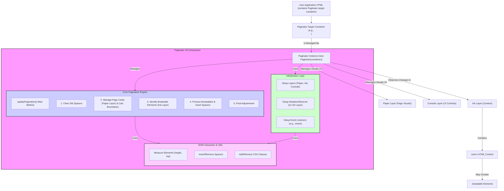

```mermaid
graph TD
    UserApp["User Application HTML (contains Paginator target container)"] --> PaginatorContainer["Paginator Target Container (e.g., <div id='my-document'>)"];

    subgraph PaginatorComponent ["Paginator JS Component"]
        direction LR
        PaginatorInstance["Paginator Instance (new Paginator(container))"]
        
        subgraph Initialization ["Initialization Logic"]
            InitLayers["Setup Layers (Paper, Ink, Console)"]
            InitObserver["Setup MutationObserver (on Ink Layer)"]
            InitEvents["Setup Event Listeners (e.g., resize)"]
        end

        subgraph CorePaginationEngine ["Core Pagination Engine"]
            direction TB
            UpdatePagination["updatePagination() Main Method"]
            ClearHelpers["1. Clear Old Spacers"]
            ManagePageCards["2. Manage Page Cards (Paper Layer) & Calc Boundaries"]
            GetBreakables["3. Identify Breakable Elements (Ink Layer)"]
            ProcessBreakables["4. Process Breakables & Insert Spacers"]
            FinalAdjust["5. Final Adjustments"]
        end

        subgraph DOMInteraction ["DOM Interaction & Utils"]
            direction TB
            DOMMeasurement["Measure Elements (height, top)"]
            SpacerInsertion["Insert/Remove Spacers"]
            ClassManipulation["Add/Remove CSS Classes"]
        end
        
        PaginatorInstance -- Manages --> CorePaginationEngine;
        PaginatorInstance -- Uses --> Initialization;
        CorePaginationEngine -- Uses --> DOMInteraction;
        Initialization -- Uses --> DOMInteraction;
    end

    PaginatorContainer -- Is Managed By --> PaginatorInstance;
    PaginatorInstance -- Observes Changes In --> InkLayer["Ink Layer (Content)"];
    PaginatorInstance -- Manages Visuals Of --> PaperLayer["Paper Layer (Page Visuals)"];
    PaginatorInstance -- Manages Visuals Of --> ConsoleLayer["Console Layer (UI Controls)"];

    InkLayer -- Contains --> UserContent["User's HTML Content"];
    UserContent -- May Contain --> BreakableElements[".breakable Elements"];

    style PaginatorComponent fill:#f9f,stroke:#333,stroke-width:2px
    style CorePaginationEngine fill:#ccf,stroke:#333,stroke-width:2px
    style Initialization fill:#cfc,stroke:#333,stroke-width:2px
    style DOMInteraction fill:#fcf,stroke:#333,stroke-width:2px
```