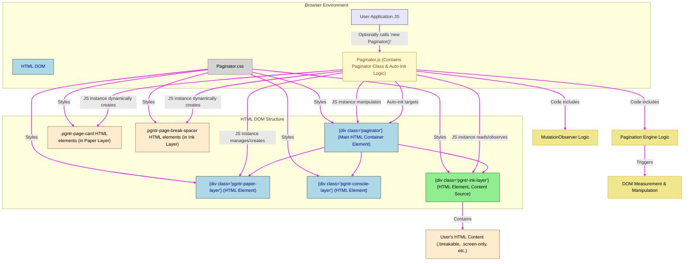

# Paginator Technical Architecture

## 1. Introduction

This document outlines the technical architecture for the Paginator MVP, a Vanilla JavaScript front-end component. Paginator is designed to simplify the development of web applications requiring skeuomorphic "digital paper" interfaces (simulating 8.5x11 inch pages with defined margins) that feature dynamic, real-time pagination capabilities in response to content changes.

The architecture prioritizes a clear separation of concerns, a CSS-driven approach for layout and styling, and a robust JavaScript engine for managing the dynamic pagination logic.

## 2. Goals of the Architecture

The primary goals for this technical architecture are:

* **Modularity:** Design the Paginator as a self-contained JavaScript module (a `Paginator` class) that can be easily integrated into various web applications.
* **Vanilla JS & CSS Driven:** Adhere to the technical constraint of using only Vanilla JavaScript (no external JS frameworks/libraries for the component itself) and making the component primarily controllable and stylable via CSS classes.
* **Real-time Dynamic Updates:** Implement an efficient mechanism (primarily using `MutationObserver`) to monitor content changes within the designated "ink layer" and automatically recalculate/update the paginated layout in real-time.
* **Three-Layer Structure:** Clearly define and manage the three core visual and functional layers:
    * **Paper Layer:** Displays the visual representation of pages.
    * **Ink Layer:** Contains the actual document content that flows across pages.
    * **Console Layer:** A structurally-expected layer for UI controls, non-printable, and overlaid on other layers.
* **Skeuomorphic Page Representation:** Accurately simulate the visual appearance of physical 8.5x11 inch paper with configurable margins.
* **Developer-Friendly Integration:** Offer a simple integration path for developers, including automatic initialization based on CSS classes, and clear error reporting via the browser console for common setup issues.
* **Testability:** Structure the component and its outputs (particularly `demonstration.html`) to facilitate effective testing of its features.
* **Print Fidelity:** Ensure that the on-screen WYSIWYG representation translates accurately to printed output via robust `@media print` styling.
* **Leverage Prior Art:** Adapt and extend successful concepts from the previous "Two-Layer Paginator" where applicable (e.g., breakable unit logic, spacer concept).

## 3. Architectural Overview Diagram

The Paginator component operates on a target HTML container (identified by the `paginator` class for auto-initialization), transforming its content into a paginated view. It consists of a core JavaScript module and a set of CSS rules.

