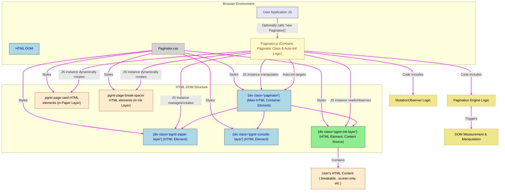

# Paginator Technical Architecture

## 1. Introduction

This document outlines the technical architecture for the Paginator MVP, a Vanilla JavaScript front-end component. Paginator is designed to simplify the development of web applications requiring skeuomorphic "digital paper" interfaces (simulating 8.5x11 inch pages with defined margins) that feature dynamic, real-time pagination capabilities in response to content changes.

The architecture prioritizes a clear separation of concerns, a CSS-driven approach for layout and styling, and a robust JavaScript engine for managing the dynamic pagination logic.

## 2. Goals of the Architecture

The primary goals for this technical architecture are:

* **Modularity:** Design the Paginator as a self-contained JavaScript module (a `Paginator` class) that can be easily integrated into various web applications.
* **Vanilla JS & CSS Driven:** Adhere to the technical constraint of using only Vanilla JavaScript (no external JS frameworks/libraries for the component itself) and making the component primarily controllable and stylable via CSS classes.
* **Real-time Dynamic Updates:** Implement an efficient mechanism to monitor content and container changes and automatically recalculate/update the paginated layout in a way that feels real-time to the user.
* **Three-Layer Structure:** Clearly define and manage the three core visual and functional layers:
    * **Paper Layer:** Displays the visual representation of pages.
    * **Ink Layer:** Contains the actual document content that flows across pages.
    * **Console Layer:** A structurally-expected layer for UI controls, non-printable, and overlaid on other layers.
* **Skeuomorphic Page Representation:** Accurately simulate the visual appearance of physical 8.5x11 inch paper with configurable margins.
* **Developer-Friendly Integration:** Offer a simple integration path for developers, including automatic initialization based on CSS classes, and clear error reporting via the browser console for common setup issues.
* **Facilitate Testability and Proof-of-Concept Development:** Design the Paginator's real-time update mechanisms, CSS-driven approach, and clear API to directly support the dynamic and interactive nature of the demonstration.html file and the BC Form 22 PoC. This ensures these artifacts can serve as effective testbeds for Paginator's functionalities.
* **Testability:** Structure the component and its outputs (particularly `demonstration.html`) to facilitate effective testing of its features.
* **Print Fidelity:** Ensure that the on-screen WYSIWYG representation translates accurately to printed output via robust `@media print` styling.
* **Leverage Prior Art:** Adapt and extend successful concepts from the previous "Two-Layer Paginator" where applicable (e.g., breakable unit logic, spacer concept).

## 3. Architectural Overview Diagram

The Paginator component operates on a target HTML container (identified by the `paginator` class for auto-initialization), transforming its content into a paginated view. It consists of a core JavaScript module and a set of CSS rules.



Diagram Explanation:


* **Browser Environment:** Contains the overall HTML Document Object Model (DOM), the user application's JavaScript, the Paginator's JavaScript file (Paginator.js), and the Paginator's CSS file (Paginator.css).
* **Paginator.js (Contains Paginator Class & Auto-Init Logic):** This represents our JavaScript file. It defines the Paginator class (the blueprint for creating Paginator functionality) and includes a script that automatically finds designated HTML elements to activate pagination. The Paginator class itself encapsulates internal logic for DOM observation, pagination calculations (the "Pagination Engine"), and DOM manipulation.
* **<div class='paginator'> (Main HTML Container Element):** This is an HTML div element that the web developer includes in their page. They add the class paginator to this div to tell Paginator.js to manage it.
* **Layer HTML Elements (.pgntr-paper-layer, .pgntr-ink-layer, .pgntr-console-layer):** These are specific HTML div elements that the developer must place inside their <div class='paginator'>. They represent the structural layers required by the Paginator.
  * The Ink Layer HTML Element is where the developer places their actual document content.
* **.pgntr-page-card HTML elements & .pgntr-page-break-spacer HTML elements:** These are HTML elements that the Paginator's JavaScript instance dynamically creates and adds to the Paper Layer and Ink Layer respectively, to create the visual pages and control content flow.
* **Arrows Indicate Interaction:**
  * Paginator.js (specifically, the Paginator JavaScript instance it creates) "manipulates," "reads/observes," and "manages/creates" the various HTML elements.
  * Paginator.css "styles" these HTML elements.
  * User Application JS: The developer's own JavaScript can optionally interact with Paginator.js (e.g., by manually creating a new Paginator() if they choose not to use the auto-initialization).


## 4. Core Components

### 4.1. JavaScript (`Paginator.js`)

The core of the Paginator is a single Vanilla JavaScript file, `paginator.js`, which defines the `Paginator` class and includes an auto-initialization routine.

The Paginator component primarily operates directly on the Document Object Model (DOM). It does not maintain significant internal JavaScript data structures to represent pages or content blocks. Instead, its state and understanding of the document structure are largely derived from querying and manipulating live DOM elements and their properties in real-time.

**`Paginator` Class:**

* **Constructor (`constructor(containerElement, options)`):**
    * Takes the target HTML container element and an optional configuration object.
    * Initializes internal properties (references to layers, options, state variables like `lastScrollTime`, `isUpdating`).
    * Calls internal methods to set up layers, resize observers, scroll and print listeners, and performs an initial pagination.
    * Performs validation checks on the provided `containerElement` structure.
* **Core Methods:**
    * `updatePagination()`: The main public method (callable for manual refresh if ever needed) and internal workhorse. Orchestrates the process of clearing old state, calculating page boundaries, managing visual page cards in the Paper Layer, processing breakable elements in the Ink Layer, and inserting/removing spacer elements. Has re-entrancy protection using `isUpdating`.
    * `_setupLayers()`: Identifies the `pgntr-paper-layer`, `pgntr-ink-layer`, and `pgntr-console-layer` within the target container. Validates their presence and uniqueness.
    * `_setupResizeObservers()`:
        * Initializes and configures a `ResizeObserver` on the `.pgntr-ink-layer`. Its callback (debounced, e.g., 150ms, with a 1-2px height change threshold) calls `updatePagination()` if a significant height change is detected. If no significant height change is detected, it checks a "recent scroll" flag (set by `_setupScrollListener`). If true, it calls `_performSecondarySpacerValidation()`. Uses `borderBoxSize` with fallback. Prevents action if `isUpdating` is true.
        * Initializes and configures a `ResizeObserver` on the main `paginator` HTML container element to detect overall component resizes. Its callback (debounced) calls `updatePagination()`. Prevents action if `isUpdating` is true.
    * `_performSecondarySpacerValidation()`: Called if the `.pgntr-ink-layer` `ResizeObserver` detects no significant net height change but a recent scroll has occurred. This method calculates the ideal Y-positions for the tops of breakable elements that should follow existing page spacers (i.e., at the top of a page's content area) and compares them to their actual Y-positions. If a significant misalignment is found, it calls `updatePagination()`.
    * `_setupScrollListener()`: Attaches a debounced scroll event listener to the `window` (or the Paginator's scrollable ancestor). On scroll, it updates a flag or timestamp indicating recent scroll activity (e.g., `this.userHasScrolledRecently = true;` and resets it after a timeout or when checked).
    * `_setupPrintListener()`: Attaches an event listener for the `window.beforeprint` event. This handler calls `updatePagination()` to ensure the layout is correct immediately before printing. It must manage the `isUpdating` flag carefully and ensure `updatePagination` completes.
    * `_clearPaginationHelpers()`: Removes all temporary elements (e.g., `.pgntr-page-break-spacer`) from the `pgntr-ink-layer`.
    * `_calculateAndRenderPageCards()`: Measures content height in the `pgntr-ink-layer`, determines the number of required visual pages, adds/removes `.pgntr-page-card` elements in the `pgntr-paper-layer`, and calculates the precise top/bottom boundaries for the content area of each visual page.
    * `_getBreakableElements()`: Queries the `pgntr-ink-layer` for all elements with the `.breakable` class, then sorts them by their document order. Includes the sentinel breakable element at the end of the ink layer.
    * `_processBreakableElements()`: Iterates through sorted breakable elements. For each, calculates its block height (e.g., using element.getBoundingClientRect().height) and determines if it overflows the current visual page. If so, calculates and inserts a `.pgntr-page-break-spacer`. It should be noted that if an element marked as .breakable is itself taller than a single page and cannot be internally broken down further (e.g., a very large image), Paginator will not attempt to split it. The 'degradation' of such content (e.g., overflow, clipping) will depend on browser behavior and any explicit styling applied by the developer.
    * `_insertPageBreakBeforeElement()`: Creates and inserts a spacer element (`div`) before a given breakable element. Adds print-specific `break-before: page;` style to the actual element being pushed.
    * `_ensureSentinelBreakableExists()`: Ensures a zero-height `.breakable` element is present as the last child of the `pgntr-ink-layer`. This sentinel is crucial to aid in accurately calculating the height of the final content block on the last page and ensuring that all content is correctly processed by the pagination logic.
    * `destroy()`: Public method to clean up the Paginator instance (disconnects observers, removes event listeners, clears helpers).
* **Utility Methods:** Internal helpers for DOM measurements, unit conversions, console logging.
* **State Management:** Internal properties like `isUpdating`, `userHasScrolledRecently` (or `lastScrollTime`), `options`.

**Auto-Initialization Routine (within `paginator.js`):**

* Runs on `DOMContentLoaded`.
* Queries the DOM for elements with the class `paginator`.
* For each found element:
    * Performs validation (logs errors/warnings to console):
        * Checks for the presence and uniqueness of child `div`s with classes `.pgntr-paper-layer`, `.pgntr-ink-layer`, and `.pgntr-console-layer`. Logs errors if missing or duplicated.
    * If validation passes, creates a `new Paginator(foundElement, optionsFromDataAttributes)`.
* If `paginator.js` is loaded but no elements with class `paginator` are found, logs a warning to the console.

### 4.2. CSS (`paginator.css`)

A single CSS file providing all necessary styles. CSS variables will be used for key metrics like page dimensions and margins to allow for easier customization if needed.

* **Layout Styles:**
    * Styling for the main `paginator` container (e.g., `position: relative`).
    * **Layer Styling:**
        * `.pgntr-paper-layer`: `position: absolute` (or `relative`), `z-index: 1`, `display: flex`, `flex-direction: column`, `align-items: center`, `gap: var(--pgntr-page-gap, 30px)`.
        * `.pgntr-ink-layer`: `position: relative`, `z-index: 2`, `width: var(--pgntr-page-width-actual)`, `padding: var(--pgntr-page-inset-actual)`. `background: transparent`.
        * `.pgntr-console-layer`: `position: absolute`, `top: 0`, `left: 0`, `width: 100%`, `height: 100%`, `z-index: 3`, `pointer-events: none`. Its direct children will need `pointer-events: auto;`. Developers should place their custom UI controls as direct children of this layer and use standard CSS positioning (e.g., position: absolute;, top, left) relative to the Paginator container to place them as needed. Remember that these direct children must have pointer-events: auto; applied to be interactive.
* **Page Card Styles:**
    * `.pgntr-page-card`: `width: var(--pgntr-page-width-visual)`, `height: var(--pgntr-page-height-visual)`, `background-color: white`, `box-shadow: 0 0 10px rgba(0,0,0,0.1)`, `box-sizing: border-box`.
* **Helper Element Styles:**
    * `.pgntr-page-break-spacer`: `display: block`, `width: 100%`. Height set by JS.
    * `.pgntr-screen-only`: Class to hide elements in print.
    * `.pgntr-print-only`: Class to hide elements on screen and show in print.
* **Print Styles (`@media print`):**
    * Resetting layout: Hides `.pgntr-paper-layer`'s visual page card styling, hides `.pgntr-console-layer`.
    * Hiding screen-only elements: `.pgntr-screen-only { display: none !important; }`.
    * Showing print-only elements: `.pgntr-print-only { display: block !important; }`.
    * Ensuring `pgntr-ink-layer` content flows correctly using browser's native pagination, guided by `break-before: page;` styles applied by the JS.
    * `@page` rule to define default print page size and margins. Standard CSS properties like `page-break-inside: avoid;` for table rows, and `page-break-after: avoid;` for headings.


## 5. Developer Usage Model

The Paginator component is designed for ease of use with a primarily declarative approach, supported by optional JavaScript interaction.

### 5.1. Automatic Initialization (Recommended for Simplicity)

1.  **Include Files:**
    * Link `paginator.css` in the `<head>` of the HTML document.
    * Include `paginator.js` at the end of the `<body>` (ideally with `defer` attribute).
2.  **HTML Structure:** The developer creates a main container `div` and assigns it the class `paginator`. Inside this container, they must include three direct child `div`s with the specified Paginator layer classes:
    ```html
    <div id="myDocument" class="paginator">
        <div class="pgntr-paper-layer"></div>
        <div class="pgntr-ink-layer">
            <h1 class="breakable">My Document Title</h1>
            <p>This is some content that will be paginated.</p>
            <p class="breakable screen-only">This paragraph is breakable and only appears on screen.</p>
        </div>
        <div class="pgntr-console-layer">
        </div>
    </div>
    ```
3.  **Apply Functional Classes:**
    * Add `.breakable` to any element within the `.pgntr-ink-layer` where a page break is permissible *before* the element.
    * Add `.screen-only` to elements that should only appear on screen and not be printed.
    * Add `.pgntr-print-only` to elements that should only appear in print output (not on screen).
4.  **Activation:** The Paginator automatically initializes on any `div` with the `paginator` class when the `DOMContentLoaded` event fires. No explicit JavaScript call is needed from the developer for basic usage.
5.  **Configuration via Data Attributes (Optional):**
    Basic options can be configured via `data-*` attributes on the `<div class="paginator">` element. For example:
    ```html
    data-page-width="8.5in"
    data-page-height="11in"
    data-page-inset="0.5in"
    data-page-gap="20px"
    data-breakable-selector=".custom-breakable, .another-breakable"
    ```

### 5.2. Manual JavaScript Initialization (For Advanced Control)

If developers require more control (e.g., to initialize Paginator at a specific time, pass complex options, or retain an instance reference):

1.  **Include Files & HTML Structure:** Same as above, but the `paginator` class on the container is not strictly necessary if initializing manually (though it can still be used for styling).
2.  **JavaScript:**
    ```javascript
    document.addEventListener('DOMContentLoaded', () => {
        const paginatorElement = document.getElementById('myDocument');
        const options = {
            pageMargin: '1in',
            // other Paginator options
        };
        const paginatorInstance = new Paginator(paginatorElement, options);

        // Developer can now use paginatorInstance if it exposes public methods
        // e.g., paginatorInstance.repaginate();
    });
    ```

This model provides a low-friction entry point with auto-initialization while retaining the power of direct JavaScript instantiation for advanced scenarios. The console validations will guide developers in setting up the HTML structure correctly.

## 6. Risk Assessment and Mitigation

This section identifies potential technical risks for the Paginator MVP and outlines mitigation strategies.

* **Risk: Performance of Real-time Updates and Layout Audits:**
    * **Description:** The `updatePagination()` method, which performs significant DOM measurement and manipulation, can be resource-intensive. `ResizeObserver` callbacks (if not carefully debounced/thresholded) could trigger this frequently. The "Secondary Spacer Validation" also involves DOM reads.
    * **Mitigation:**
        * **Efficient `updatePagination()`:** Optimize DOM reads (e.g., batching, minimizing reads inside loops, caching dimensions if unchanged) and writes within `updatePagination()`.
        * **Debouncing `ResizeObserver` Callbacks & Thresholds:** Ensure `ResizeObserver` callbacks that trigger `updatePagination()` or secondary validation are effectively debounced (e.g., 150ms) with appropriate height change thresholds (e.g., 1-2px) to avoid excessive firing.
        * **Efficient Scroll Listener:** The scroll listener setting the `userHasScrolledRecently` flag should be lightweight (`passive: true`) and itself debounced or use a timestamp to define "recent."
        * **Optimized Secondary Spacer Validation:** The `_performSecondarySpacerValidation()` logic must be efficient. It checks existing spacer/breakable positions against calculated ideals.
        * **Re-entrancy Protection:** The `isUpdating` flag is critical to prevent `updatePagination()` from being called recursively or concurrently.
        * **Targeted Testing:** Use `demonstration.html` with very large/complex content and rapid interactive changes to profile and identify performance bottlenecks.

* **Risk: Cross-Browser Consistency:**
    * **Description:** Browsers may have slight differences in rendering CSS, calculating element dimensions (especially with sub-pixel rendering), `ResizeObserver` behavior, and print styles.
    * **Mitigation:**
        * **Thorough Testing:** Test across all target browsers (Chrome, Firefox, Safari, Edge, Brave) throughout development.
        * **Standard APIs:** Rely on well-supported standard browser APIs. `ResizeObserver` is widely supported; `borderBoxSize` is the modern way to get dimensions.
        * **Print Testing:** Print output requires extensive testing across browsers. The `beforeprint` triggered update is a key mitigation here.

* **Risk: Complexity of "Block Height" Calculation & Spacer Logic:**
    * **Description:** Accurately determining the height of a "content block" for `_processBreakableElements()` and ensuring precise spacer insertion/validation can be complex.
    * **Mitigation:**
        * **Clear Algorithm:** Leverage and refine algorithms from the "Two-Layer Paginator." The sentinel element helps with the last block.
        * **Iterative Refinement & Testing:** Use `demonstration.html` for diverse content structures.
        * **Visual Debugging Aids:** Implement temporary visual cues for spacers and boundaries during development.

* **Risk: Accuracy of WYSIWYG vs. Print:**
    * **Description:** Discrepancies between the on-screen view and the browser's native print output.
    * **Mitigation:**
        * **Standard Print Properties:** Use `break-before: page;` effectively.
        * **Consistent Margins:** Align ink layer padding with `@page` margins.
        * **`beforeprint` Failsafe:** The `updatePagination()` call on `beforeprint` is a key mitigation.

* **Risk: Scope Creep / Aggressive Timeline:**
    * **Description:** The 4-week MVP timeline is firm.
    * **Mitigation:**
        * **Strict Scope Adherence:** Focus on PRD MVP scope.
        * **Prioritize Core Engine:** Ensure the pagination logic and dynamic updates are robust first.

* **Risk: Developer Setup Errors:**
    * **Description:** Incorrect HTML structure by users of the Paginator.
    * **Mitigation:**
        * **Console Validation:** Implement clear console warnings/errors for setup issues.
        * **Comprehensive `demonstration.html`:** Serves as a living example.
        * **Clear Documentation:** The `Developer Usage Model` in this document and other guides.

* **Risk: UX of Scroll-Gated Secondary Validation:**
    * **Description:** If the "Secondary Spacer Validation" (triggered after a scroll, for the rare canceling-heights edge case) causes a noticeable layout shift, it might feel slightly jarring to the user.
    * **Mitigation:**
        * **Optimize Validation & `updatePagination()`:** Make these as fast as possible to minimize any perceived delay or jank.
        * **Tune Debounce/Interval for Scroll Check:** Ensure the "recency" of a scroll is appropriately balanced with responsiveness.
        * **Monitor During Testing:** Observe this behavior during testing of `demonstration.html` and the PoC. For MVP, a slight occasional adjustment on scroll for a rare edge case is likely acceptable.
